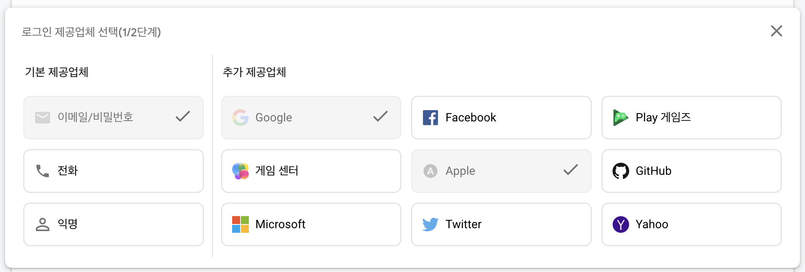
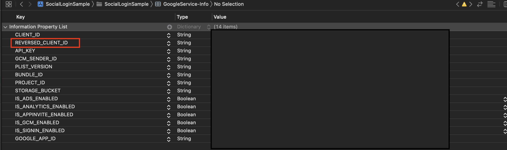
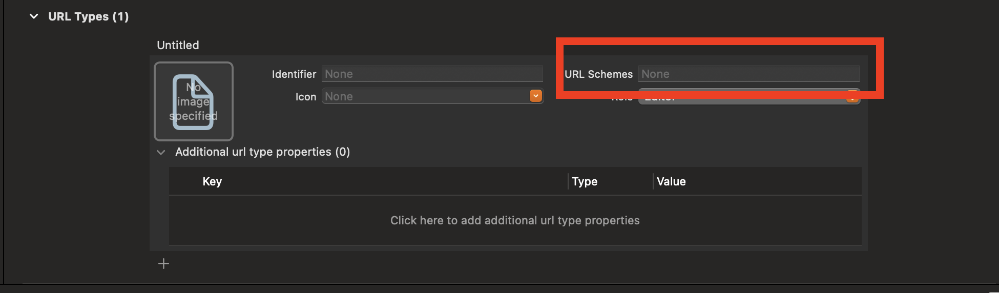
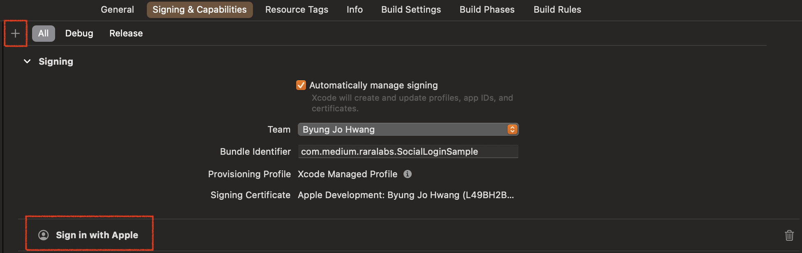
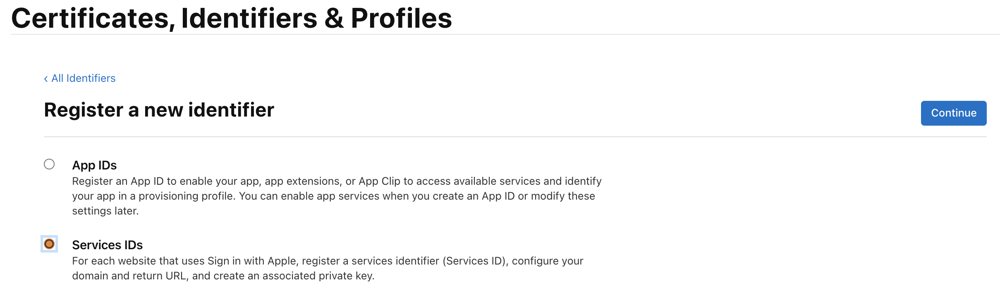
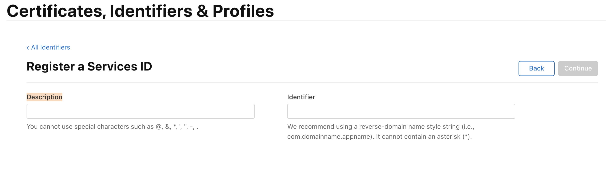
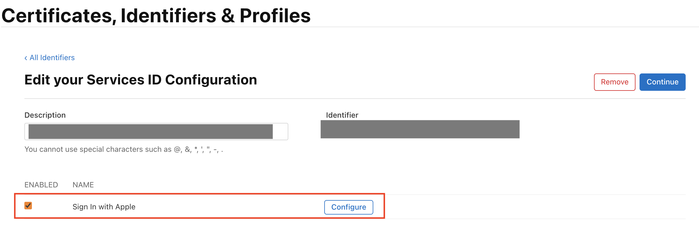
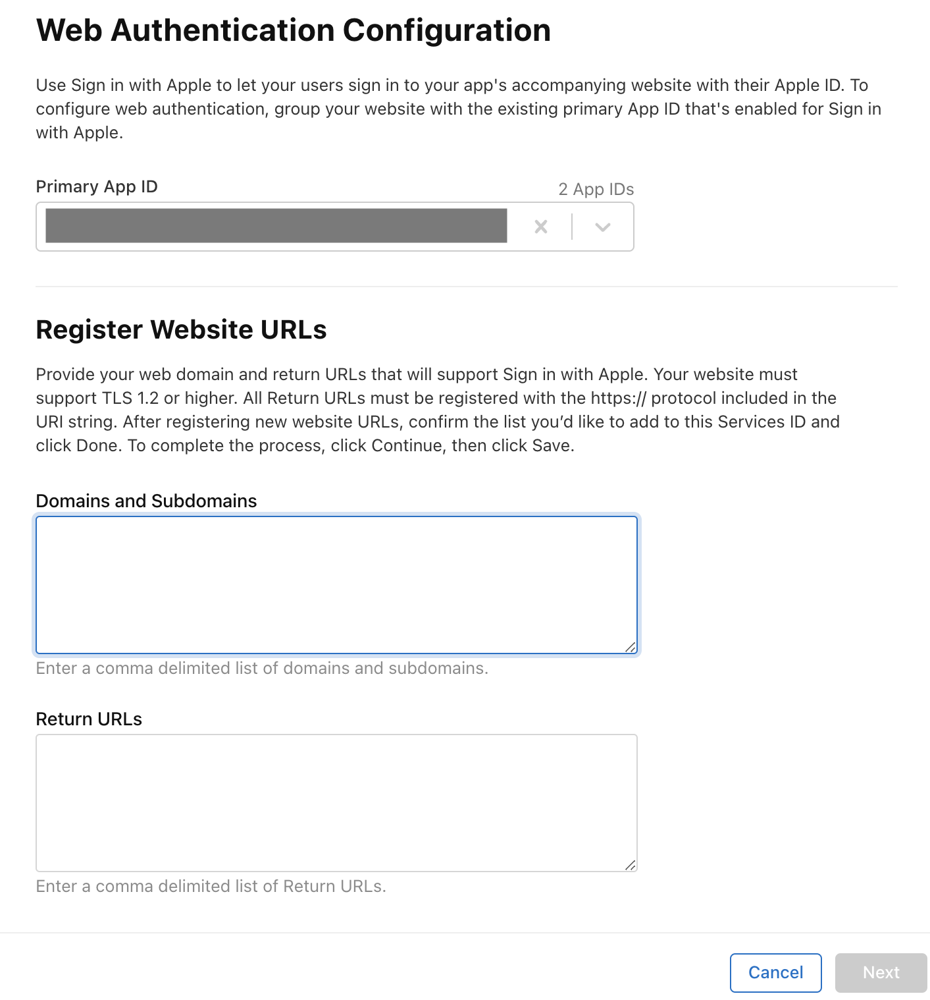
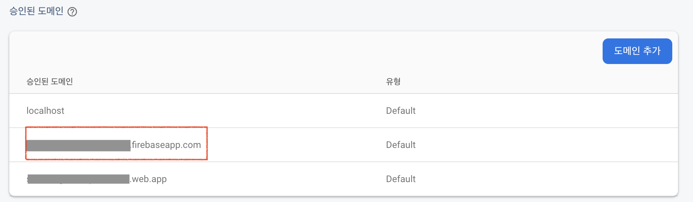
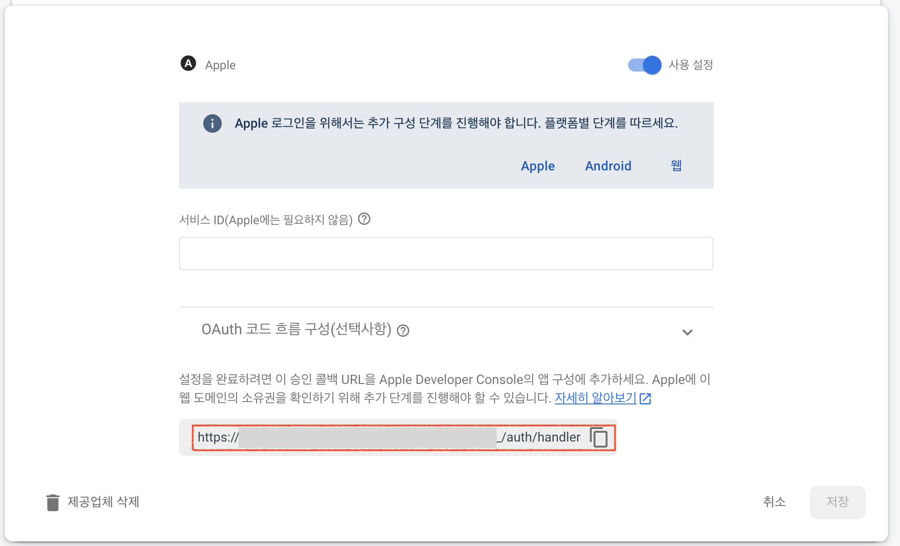

# Social Login Sample

[Firebase](https://firebase.google.com/?hl=ko) 를 사용하여 소셜로그인을 구현한 샘플입니다.

## 환경설정

FireBase -> Authentication -> Sign In Method 에서 로그인 제공업체를 선택해 줍니다.

프로젝트 설정에서  `GoogleService-Info.plist` 를  다운받아 프로젝트에 추가합니다.

### Google 

`GoogleService-Info.plist` 에 있는 **REVERSED_CLIENT_ID** 를 URL Schemes 에 추가해 줍니다. 

URL Schemes에 추가

### Apple 

Signing & Capabilities 에 + 버튼을 눌러서 Sign in with Apple 항목을 추가합니다. 

[Apple Developer](https://developer.appple.com) 에서 [Identifiers](https://developer.apple.com/account/resources/identifiers/list) 추가 하는 페이지로 이동합니다. 

 **Services IDs** 항목을 선택합니다. 

**Description** 와 **Identifier**를 작성합니다.

(Identifier 는 번들아이디 뒤에 .signin 만 붙여줬습니다.)

> com.company.projectname.signin

생성된 **Identifier** 를 클릭해서 체크버튼을 클릭하고 configure버튼을 클릭합니다.

- Primary App ID 맞게 선택되어있는지 확인합니다.

- Domains and Suddomains 와 Return URLs 값은 **Firebase** 에 있는 정보를 복사해서 붙여주면 됩니다.

#### Domains and Subdomains

**Firebase** -> Authentication -> Sign-in-method -> 승인된 도메인

#### Return URLs

**Firebase** -> Authentication -> Sign-in-method -> 제공업체 -> 애플 선택

> 애플 로그인은 시뮬레이터에는 테스트가 안되서 디바이스에서 확인했습니다. 

### facebook

